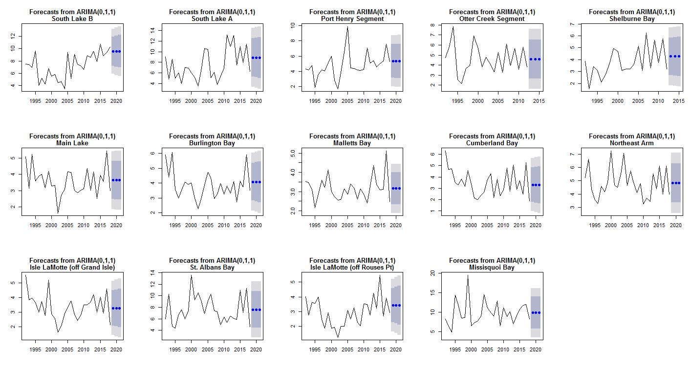

# Predict Algal Blooms in Lake Champlain 

### Links
- Meetup: [Stats-A-Thon Wrap Up](https://www.meetup.com/Burlington-Data-Scientists/events/259092234/)
- Department of Environmental Conservation: [Lake Champlain Long Term Monitoring Project](https://dec.vermont.gov/watershed/lakes-ponds/monitor/lake-champlain)

### Data Exploration
- Correlations between various water quality parameters and the amount of chlorophyll.
The relationship between total phosphorus and chlorophyll is the most promising. 

### Predictions
- Predictions for chlorophyll amounts at each testing station for years 2019-2021.
